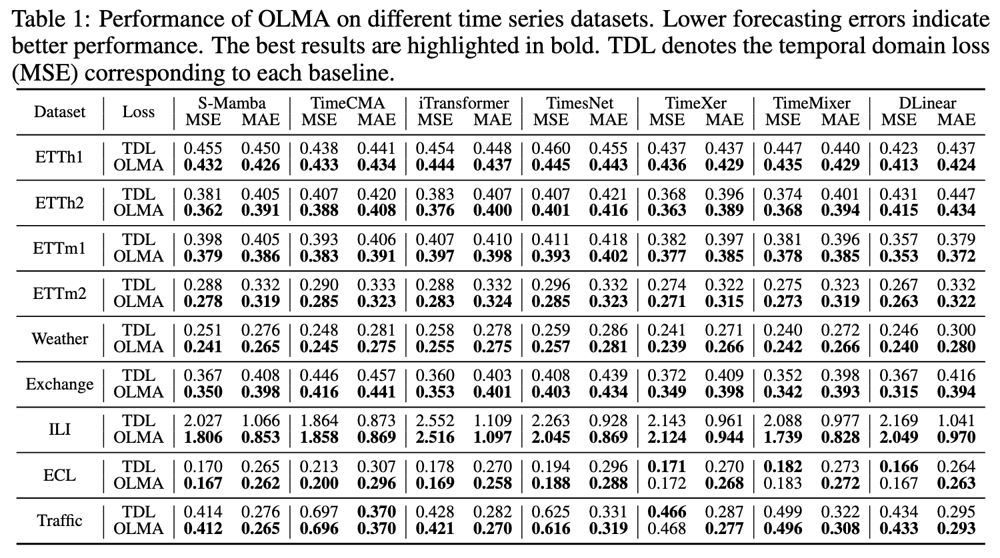
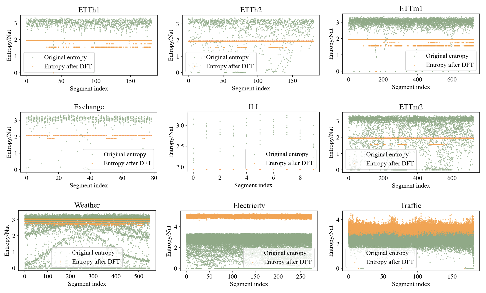
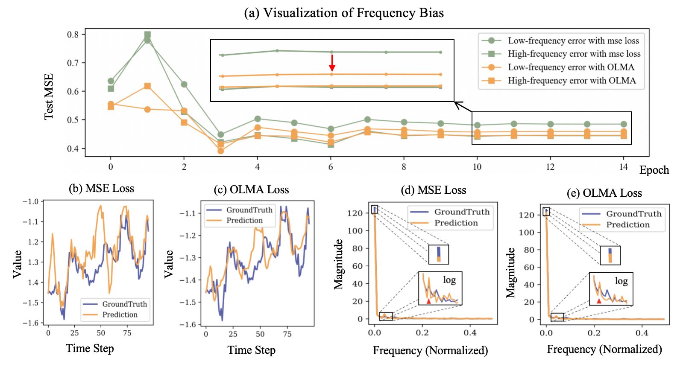

# OLMA: One Loss for More Accurate Time Series Forecasting

  
  
  

⚡ OLMA can replace the original loss function of any supervised  time series forecasting model to improve their performance!

## 🚀 Core File

[📄 OLMA.py](OLMA_Main.py) — **OLMA is Hear!**.  

  

## ✨ Why OLMA?
1. The entropy of random noise imposes a fundamental limit on the theoretical lower bound of time series forecasting error.
2. Most models suffer from *frequency bias* when predicting time series.  
**OLMA** changes the game:
- 🎯 Both theoretical analysis and empirical results demonstrate the existence of a unitary transformation that can reduce the marginal entropy of multivariate time series.
- 📉 Direct supervision in the frequency domain alleviates the spectral bias inherent in neural networks.
- 🛠️ Plug-and-play: works with Transformer, CNN, MLP, Mamba, Linear and even LLM-based forecasters.

> OLMA is not just a loss. It’s a **guarantee** for stronger time series forecasting.

## Abstract
Time series forecasting faces two important but often overlooked challenges. Firstly, the inherent random noise in the time series labels sets a theoretical lower bound for the forecasting error, which is positively correlated with the entropy of the labels. Secondly, neural networks exhibit a frequency bias when modeling the state-space of time series, that is, the model performs well in learning certain frequency bands but poorly in others, thus restricting the overall forecasting performance. To address the first challenge, we prove a theorem that there exists a unitary transformation that can reduce the marginal entropy of multiple correlated Gaussian processes, thereby providing guidance for reducing the lower bound of forecasting error. Furthermore, experiments confirm that Discrete Fourier Transform (DFT) can reduce the entropy in the majority of scenarios. Correspondingly, to alleviate the frequency bias, we jointly introduce supervision in the frequency domain along the temporal dimension through DFT and Discrete Wavelet Transform (DWT). This supervision-side strategy is highly general and can be seamlessly integrated into any supervised learning method. Moreover, we propose a novel loss function named OLMA, which utilizes the frequency domain transformation across both channel and temporal dimensions to enhance forecasting. Finally, the experimental results on multiple datasets demonstrate the effectiveness of OLMA in addressing the above two challenges and the resulting improvement in forecasting accuracy. The results also indicate that the perspectives of entropy and frequency bias provide a new and feasible research direction for time series forecasting.

## Theoretical Derivation
Let $x$ be a continuous random variable with differential entropy $h(x)$, and let $\hat{x}$ be an unbiased estimate of $x$ formed without any side information. Under this constraint, unbiasedness requires $\hat{x} = \mathbb{E}[x]$, so the estimation error $e = x - \hat{x} = x - \mathbb{E}[x]$ is zero-mean.  

Since differential entropy is translation-invariant, $h(e) = h(x)$. According to the maximum entropy theorem for continuous random variables with given mean and variance, for any random variable, its entropy is upper-bounded by that of a Gaussian with the same variance:

$$
h(e) = h(x) \le \tfrac{1}{2} \log(2 \pi e \, \mathrm{Var}(e)).
$$

where $\mathrm{Var}$ denotes the variance. It can be rearranged to give the desired lower bound on the mean squared error:

$$
\mathbb{E}[(x - \hat{x})^2] = \mathrm{Var}(e) \ge \tfrac{1}{2 \pi e} \, 2^{2 h(x)}.
$$

The equality holds if and only if $x$ is Gaussian.

Let $Y \in \mathbb{R}^{c \times l}$ denote the time series labels with $c$ dimensions (channels) and length $l$. The label is decomposed into two components as $Y = Z + N$, where $Z, N \in \mathbb{R}^{c \times l}$ denote components of learnable deterministic process (without randomness, the entropy is theoretically zero) and components of unlearnable stochastic noise respectively. We assume that $N$ is Gaussian and mutually independent across different time steps for analytical tractability. Thus, the lower bound of $N_i \in \mathbb{R}^{l}$, the variable $i^{th}$ of $N$, is

$$
\sum_{t=1}^{l}\mathbb{E}[(N_i[t] - \hat{N}_i[t])^2] 
\ge \sum_{t=1}^{l}\frac{1}{2 \pi e} 2^{2 h(N_i[t])} 
= \frac{l}{2 \pi e} 2^{2 h(N_i)}.
$$

This indicates that the lower bound of the forecasting error for each time series variable is positively correlated with its own entropy. If there exists an invertible transformation that can reduce entropy, the lower bound of the forecasting error can be decreased, thereby improving the forecasting accuracy. In this regard, we propose **Theorem 1**, which demonstrates that such transformation indeed exists.

---

### Theorem 1  
If multiple Gaussian stochastic processes are internally independent and identically distributed (i.i.d.) but exhibit correlations across processes, then there necessarily exists a unitary transformation that reduces their marginal entropy, i.e., the sum of the entropy of each individual process.

---

Before proving Theorem 1, we state 3 lemmas that will be used in the proof.

---

**Lemma 1.**  
Let $A \in \mathbb{C}^{n \times n}$ be a positive definite Hermitian matrix with main diagonal elements $a_{11}, a_{22}, \ldots, a_{nn}$. Then the determinant of $A$ satisfies the inequality:

$$
\det(A) \leq \prod_{j=1}^{n} a_{jj},
$$

with equality if and only if $A$ is a diagonal matrix.

*Proof.* Since $A$ is positive definite Hermitian, it admits a unique Cholesky decomposition $A=LL^* $, where $L$ is a lower triangular matrix with $l_{ii} > 0$ for $i = 1, 2, \ldots, n$, and $L^{*}$ denotes the conjugate transpose of $L$. The determinant of $A$ can be expressed as

$$
\det(A)=\det(LL^{*})=|\det(L)|^2=(\prod^{n}_{i=1}l_{ii})^2.
$$

The diagonal elements of $A$ are given by $a_{ii}=\sum_{k=i}^{n}|l_{ik}|^2\geq|l_{ii}|^2$, for $i = 1, 2, \ldots, n$. Taking the product of these inequalities yields

$$
\prod^{n}_{i=1}a_{ii}\geq \prod^{n}_{i=1}|l_{ii}|^2=(\prod^{n}_{i=1}l_{ii})^2=\det(A).
$$

Equality holds if and only if $a_{ii} = l_{ii}^{2}$ for all $i$, which requires $l_{ik} = 0$ for all $k < i$. This implies $L$ is diagonal, and consequently $A = L L^{*}$ is also diagonal. Thus, Lemma 1 is proved.

**Lemma 2. (Unitary diagonalization of a Hermitian matrix)**  
Let $A \in \mathbb{C}^{n \times n}$ be a Hermitian matrix (i.e., $A = A^* $). Then there exists a unitary matrix $U \in \mathbb{C}^{n \times n}$ (i.e., $U^* = U^{-1}$) and a real diagonal matrix $\Lambda = \text{diag}(\lambda_1, \lambda_2, \dots, \lambda_n)$ such that

$$
A = U \Lambda U^*.
$$

The columns of $U$ form an orthonormal basis of $\mathbb{C}^n$ consisting of eigenvectors of $A$, and the diagonal entries of $\Lambda$ are the corresponding eigenvalues.  
Furthermore, if $A$ is positive definite, then all eigenvalues $\lambda_i$ are positive.

**Lemma 3. (Path-Connectedness of the Unitary Group)**  
The unitary group $\mathcal{U}(n)$ is path-connected. That is, for any two unitary matrices $U, V \in \mathcal{U}(n)$, there exists a continuous function $\varphi: [0, 1] \to \mathcal{U}(n)$ such that $\varphi(0) = U$ and $\varphi(1) = V$.

**Proof of Theorem 1.**  
Let $G \in \mathbb{R}^{c \times l}$ denote $c$ correlated Gaussian stochastic processes and length $l$. For each process $G_i$, since the variables are i.i.d. Gaussian, its entropy is

$$
h(G_i)=\frac{1}{2}\log\big((2\pi e)^l\det(\Sigma_i)\big)
\overset{\text{i.i.d.}}{=}\frac{l}{2}\log(2\pi e\sigma_i^2),
$$

where $\Sigma_i$ is the covariance matrix of $G_i$, and $\sigma_i^2$ corresponds to the variance of each Gaussian random variable. The sum of the marginal entropy of $G$ is

$$
\sum_{i=1}^{c} h(G_i)=\sum_{i=1}^{c}\frac{l}{2}\log(2\pi e\sigma_i^2)
=\frac{l}{2}\log\big((2\pi e)^c\prod_{i}^{c}\sigma_i^2\big).
$$

It is evident that $\prod_{i}^{c}\sigma_i^2$ is the product of the first-order principal minors of the covariance matrix of $G$, which is denoted as $S=\frac{1}{l}GG^* $, where $G^*$ is the conjugate transpose matrix of $G$. When a unitary transformation $F$ is applied to $G$, the covariance matrix $S_u$ is transformed into

$$
S_u = \frac{1}{l} F G (F G)^* 
    = F \left( \frac{1}{l} GG^* \right) F^* 
    = FSF^*.
$$

According to **Lemma 1**, $\det(S)<\prod_{i}^{c}\sigma_i^2$, because the $G_i$ are correlated, the equality does not apply. According to **Lemma 2**, there is necessarily a unitary transformation $F_v$ such that $S_u$ becomes a diagonal matrix, which means $\det(S_u)=\prod_{i=1}^{c}\hat{\sigma}_i^2$, where $\hat{\sigma}_i^2$ is the element on the main diagonal of $S_u$. Since a unitary transformation does not change the determinant of a matrix, $\det(S)=\det(S_u)$.

In summary, there exists a unitary transformation $\varphi(0)=I$ (identity matrix) such that the main diagonal of the covariance matrix of $G$ remains unchanged, and there also exists a unitary transformation $\varphi(1)=F_v$ that reduces it to its minimum value $\det(S)$. Since the unitary space is continuous (from $\varphi(0)=I$ to $\varphi(1)=F_v$), the range of attainable values forms a closed real value interval (from $\prod_{i}^{c}\sigma_i^2$ to $\det(S)$ ), there necessarily exists a $F_{\lambda}=\varphi(\lambda), 0<\lambda<1$ such that

$$
\det(S)<\prod_{i=1}^{c}\hat{\sigma}_i^2<\prod_{i}^{c}\sigma_i^2,
$$

that is, the product of the main diagonal entries is reduced. In conjunction with the entropy expression above, it can be rigorously deduced that there necessarily exists a unitary transformation that reduces the marginal entropy of the Gaussian process. Thus, **Theorem 1** is proved.

## OLMA Loss
We denote the model forecast as $\hat{Y} \in \mathbb{R}^{l \times c}$ and the label as $Y \in \mathbb{R}^{l \times c}$.  
According to Theorem 1, applying DFT along the channel dimension reduces the marginal entropy of multivariate time series labels.  
The channel-wise OLMA loss is:

$$
\mathcal{L}_{c} = \alpha \sum_{t=0}^{l-1}
\big\| F_f(\hat{Y}_{t,:}) - F_f(Y_{t,:}) \big\|_1,
$$

where $0<\alpha<1$ controls the strength, and $F_f$ denotes the DFT:

$$
F_f(Y_{t,:})[k] = \sum_{n=0}^{c-1} Y_{t,n}\, e^{-2\pi i kn / c},
\quad k=0,1,\dots,c-1.
$$

To further alleviate frequency bias, we apply both DFT and DWT along the temporal dimension.  
The temporal loss is:

$$
\mathcal{L}_t = \beta \sum_{i=0}^{c-1} \big\| F_f(\hat{Y_{:,i}}) - F_f(Y_{:,i}) \big\|_1 + \gamma \sum_{i=0}^{c-1} \big\| F_w(\hat{Y_{:,i}}) - F_w(Y_{:,i}) \big\|_1,
$$

where $0<\beta,\gamma<1$ with $\alpha+\beta+\gamma=1$, and $F_w$ denotes DWT.  
For $k=1,2,\dots,l/2$:

$$
Y_{2k-1,i} = \tfrac{cA_k + cD_k}{\sqrt{2}}, \quad
Y_{2k,i}   = \tfrac{cA_k - cD_k}{\sqrt{2}}, \quad
F_w(Y_{:,i}) = \{cA_1,\dots,cA_k, cD_1,\dots,cD_k\},
$$

where $cA$ and $cD$ are approximation and detail coefficients.

Finally, the overall OLMA loss combines both channel and temporal parts:

$$
\mathcal{L}_{O} = \mathcal{L}_{t} + \mathcal{L}_{c}.
$$

## Low Entropy Representation of Time Series

As shown in Figure below, the entropy of each segment is indicated with a scatter plot, where green represents the entropy of the original sequence and orange represents the entropy after applying DFT along the channel dimension. Evidently, in most scenarios, representing time series using DFT along the channel dimension can significantly reduce their marginal entropy.

  

## Alleviation of Frequency Bias

After applying OLMA supervision, the model’s ability to learn low-frequency components is substantially enhanced, while its ability to capture high-frequency components remains largely unaffected. This provides empirical evidence that applying supervision in the frequency domain allows the network to access information across all frequency bands more directly, effectively alleviating its intrinsic frequency bias. 

  

